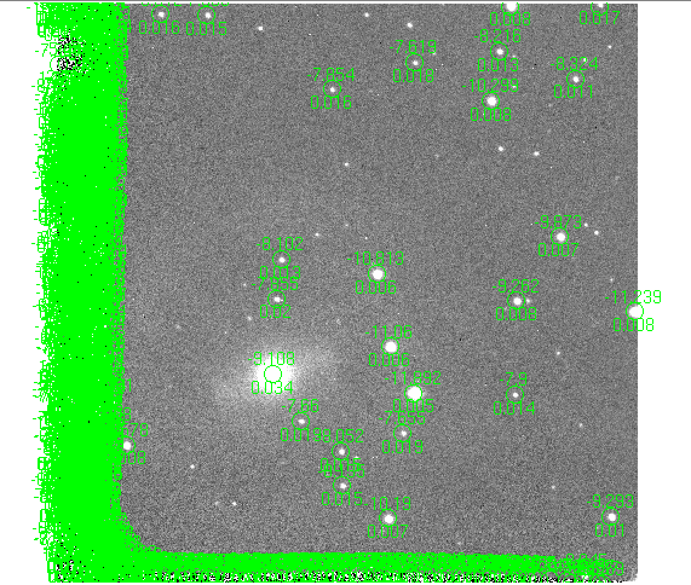

# PmPyEasy

- [ ] [Installation](#installation)
- [x] [External Packages](#etp)
  - [ ] DIAPL
  - [ ] Hotpants
  - [ ] DoPHOT
  - [x] [FITSH](#fitsh)
- [ ] [Standard Catalogs](#std)
  - [ ] [APASS DR9](#apass)
  - [ ] [PanSTARRS DR1](#panstarrs)
  - [ ] [2MASS](#2mass)
  - [ ] [ATLAS Refcat2](#refcat2)
- [ ] Examples
  - [x] [Small FOV](#smallfov)
  - [ ] [SMARTS-NIR](#smartsir)
- [ ] [Problems and Solutions](#problem)
- [ ] [Typical Routine](#routine)

## Installation 

Iraf

## External Packages 

#### DIAPL

replace malloc.h with stdlib.h

#### Hotpants

[hotpants](https://github.com/acbecker/hotpants)

#### DoPHOT

#### FITSH 

Typical installation: 1) ./configure 2) make 3) make install

FITSH is a full-featured, open-source software collection related to astronomical image and data processing written in C. Check out the wiki page of [Fitsh](1) and the [paper](2) describing the package.

Tasks used:

| Program/Task     | Main purpose |
| -----------      | ----------- |
| [fistar](3)      | Detects and characterizes point-like sources from astronomical images.      |
| [grmatch](4)     | Matches lines read from two input files of tabulated data, using various criteria (point matching, coordinate matching or identifier matching).        |
| [grtrans](5)     | Transforms a single coordinate list or derives a best-fit transformation between two coordinate lists. |
| [fitrans](6)     | Performs generic geometric (spatial) transformations on the input image. |

[1]: https://fitsh.net/wiki/Main_Page
[2]: https://ui.adsabs.harvard.edu/abs/2012MNRAS.421.1825P/abstract
[3]: https://fitsh.net/wiki/man/fistar
[4]: https://fitsh.net/wiki/man/grmatch
[5]: https://fitsh.net/wiki/man/grtrans
[6]: https://fitsh.net/wiki/man/fitrans

## Standard Catalog 
#### SDSS

[SDSS photometric flux calibration](5)

#### [APASS](1) 
[The AAVSO Photometric All-Sky Survey](6) [*DR9*](7)

The APASS photometric survey covers the whole sky in five optical bands: B, V (tied to the equatorial standards of [Landolt 2009](8)) and g, r, i (tied to the 158 primary standards given by [Smith et al. 2002](9), which define the Sloan photometric system). Each telescope covers 9 square degrees of sky with 2.5 arcsec pixels, with the main survey taken with B,V,g',r',i' filters and covering the magnitude range 10$<$V$<$17.

APASS use a 15 arcsec diameter aperture for photometry, so blends will cause photometric errors as well as astrometric ones.

#### [PanSTARRS](2) 

Pan-STARRS1 (PS1) has carried out multiband ($grizy_{P1}$) observations of the sky north of declination $-30\degree$ known as the $3\pi$ Steradian Survey\citep{Chambers2016}. Pan-STARRS1 is performed with a well-characterized photometric system, and transformations to other photometric systems are also available \citep{Tonry2012}. The primary calibration standards for photometry calibration in this work are selected from the Pan-STARRS1 DR1 MeanObject database table \citep{Flewelling2016}.

#### [2MASS](3) 

#### [ATLAS Refcat2](4) 

Key information from the paper:
  > The sources of g,r,i and z photometry include Pan-STARRS DR1, the ATLAS Pathfinder photometry project, ATLAS reflattened APASS data, SkyMapper DR1, APASS DR9, the Tycho-2 catalog, and the Yale Bright Star Catalog.
  > We will describe our Pathfinder observations and reductions, out APASS rereductions, the procedure we followed for each catalog **to bring it onto the Pan-STARRS griz-bandpass system**, and the production of the final catalog.

[1]: https://cdsarc.unistra.fr/viz-bin/cat/II/336
[2]: https://ui.adsabs.harvard.edu/abs/2012ApJ...750...99T/abstract
[3]: https://cdsarc.unistra.fr/viz-bin/cat/II/246
[4]: https://ui.adsabs.harvard.edu/abs/2018ApJ...867..105T/abstract
[5]: http://classic.sdss.org/dr5/algorithms/fluxcal.html
[6]: https://www.aavso.org/apass
[7]: https://ui.adsabs.harvard.edu/abs/2016yCat.2336....0H/abstract
[8]: https://ui.adsabs.harvard.edu/abs/2009AJ....137.4186L/abstract
[9]: https://ui.adsabs.harvard.edu/abs/2002AJ....123.2121S/abstract

## Examples

#### 1. Small FOV Case 

Situations occur when the images have small FOV and it's not likely to get the WCS solution easily. Then matching between stars in template images and standard stars from external catalog can not be done automatically where manual work required.

Display magnitudes from standard catalog and reference images and then match the common stars.

First, set the pixel scale then display the standards. *sn.standards* will be displayed on template images with (RA, Dec) transformed to image coordinate
> sn.pixscale = (0.375 for ANDICAM CCD)
>
> sn.show_standards_for_wcs_not_available(flt, std_catalog='apass', radius_arcmin=16, rotate_deg=0, brightest_N=None, invert_x=False, invert_y=False, x_mid=None, y_mid=None, display_mags=False, which_dir='raw_image')

To check how well the transformation between sky coordinate to image coordinate, we can load the standard stars to one image with well determined WCS info in header. prepare the image first then use function below:
> sn.load_current_standards_to_ds9_image(img, text1col=None, text2col=None, newds9=True)

Then, get the template mags table. The output format is: id, x, y, mag, magerr

> sn.get_template_reference_mags_flt(flt, which_dir='raw_image', renew_refmags=False)

Next, display the reference stars with labeled ID which aids selecting corresponding stars in input images or from standards stars

> sn.show_reference_stars_with_id_on_template_image_flt()

> sn.standard_calibration_flt_manual_match_method()

#### 2. SMARTS-NIR 

Photometry for SMARTS NIR images should be the most annoying work...

- First, do sky subtraction:
  > sn.smarts_nir_flt_image_reduction_sky_substraction(...)

- Then try to get the bkg and fwhm of the images:
(the typical routine will very likely fail...)

- Do PSF photometry
improper bkg value (eg. 0) and fwhm (too large) will cause the PSF photometry task fail

- Assign one template image to the images in the filter then prepare the reference star mag list
  > sn.get_template_reference_mags_flt(...)

- Relative calibration:
  > sn._photometry__get_relative_mag_single_manual_match(...)

- Calibration to 2mass:
  > sn._photometry__get_tpl_calibrated_mag_manual_method(...)

Below are one-by-one night reduction procedures:
  > nights_all, nights_flt, nights_flt_unique = sn.smarts_obs_nights_stat('J')

Check the nights available in nights_flt_unique
  > night_imgs = sn.smarts_select_photret_given_night('J', '160821')

Check the info of all images observed on the same night
  >sn.smarts_nir_flt_image_reduction_sky_substraction(night_imgs, ngroup=N)

Do the photometry
> sn.smarts_renew_fwhm_psfphot_same_night(flt, fwhm, night=None, phottable=None)

Another routine:

#### 3. UKIRT/WFCAM NIR photometry

First, WFCAM image has multiple (4) extentions. To

#### 4. Image subtraction

- refence and input image not the same size
  >
-

##  Problems and Solutions 

#### hotpants fails for image with low background values

## Typical Routine 

### RP image subtraction
